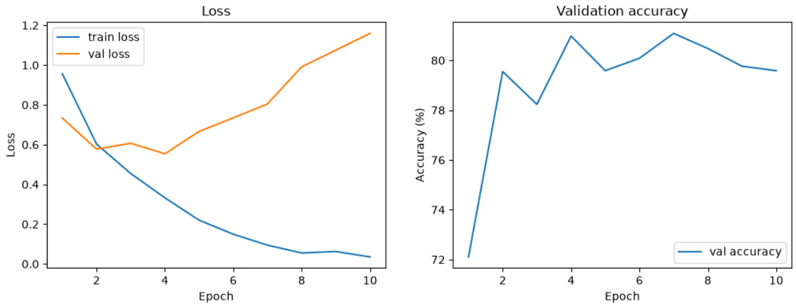
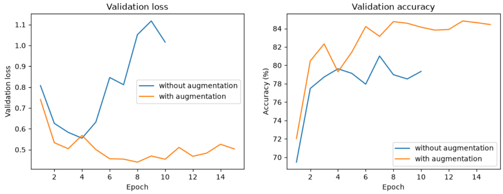
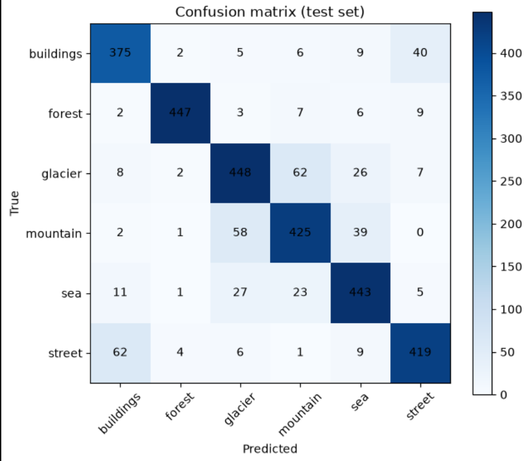

# Landscape Classification with a CNN (PyTorch)

A convolutional neural network (CNN) that classifies landscape photos into 6 classes: **buildings, forest, glacier, mountain, sea, street**. Built with PyTorch for the Data Science Academy Week 11 homework.

**Final result: 85.23% accuracy on the test set (3,000 images).**

## Dataset

[Intel Image Classification](https://www.kaggle.com/datasets/puneet6060/intel-image-classification) (Kaggle): about 25k images of size 150x150 in 6 classes.

| Split | Images | Labels |
|---|---|---|
| `seg_train` | ~14,000 | yes |
| `seg_test` | 3,000 | yes |
| `seg_pred` | 7,301 | no |

Class indices: `buildings` 0, `forest` 1, `glacier` 2, `mountain` 3, `sea` 4, `street` 5.

The images are **not included** in this repository. The notebook downloads them automatically with `kagglehub`.

## Project structure

```
ConvNet-Architecture/
├── Landscape-Classification.ipynb   # full workflow: data, training, testing, predictions
├── models/
│   └── best_model_aug.pth           # final model weights (best epoch, lowest validation loss)
├── results/
│   ├── 10-epoch.png
│   ├── with-without-augmentation.png
│   └── confusion-matrix.png
├── requirements.txt
└── README.md
```

## How to run

```bash
git clone https://github.com/uzeyirelivasli/ConvNet-Architecture.git
cd ConvNet-Architecture
pip install -r requirements.txt
jupyter notebook
```

Open `Landscape-Classification.ipynb` and run the cells from top to bottom. The dataset is downloaded on the first run. Training was done on a CPU and took roughly 100 seconds per epoch.

To load the trained model (the `SimpleCNN` class is defined in the notebook):

```python
model = SimpleCNN()
model.load_state_dict(torch.load("models/best_model_aug.pth"))
model.eval()
```

## Method

**Preprocessing**
- Resize to 150x150, convert to tensor, normalize (mean 0.5, std 0.5 for each color channel).
- The training folder is split 80/20 into train (11,227 images) and validation (2,807 images) with a fixed seed (42).
- Data augmentation, applied to the **training images only**: random horizontal flip, random rotation (up to 10 degrees), color jitter (brightness and contrast 0.2).

**Model (`SimpleCNN`, about 2.68 million parameters)**

| Layer | Output shape |
|---|---|
| Conv 3x3 (3 → 16) + ReLU + MaxPool | 16 x 75 x 75 |
| Conv 3x3 (16 → 32) + ReLU + MaxPool | 32 x 37 x 37 |
| Conv 3x3 (32 → 64) + ReLU + MaxPool | 64 x 18 x 18 |
| Flatten | 20,736 |
| Linear + ReLU | 128 |
| Linear | 6 |

**Training**
- Loss: `CrossEntropyLoss`. Optimizer: Adam, learning rate 0.001. Batch size: 32.
- After every epoch the model is evaluated on the validation set, and the weights with the **lowest validation loss** are saved and later loaded for testing.

## Experiments

| # | Experiment | Epochs | Best validation loss | Validation accuracy | Test accuracy |
|---|---|---|---|---|---|
| 1 | Baseline, no augmentation | 3 | 0.527 | 81.15% | 81.1% |
| 2 | No augmentation, longer training | 10 | ≈ 0.55 (epoch 4) | ≈ 81% | not evaluated |
| 3 | **With augmentation** | 15 | **0.440** (epoch 8) | 84.75% | **85.23%** |

What the experiments show:

- **Without augmentation the model overfits.** The training loss falls close to 0.03 while the validation loss starts rising after epoch 4 and goes above 1.0. More epochs do not help.
- **With augmentation the validation loss stays flat** (about 0.44 to 0.53 after epoch 8) and accuracy settles around 84 to 85%.
- Each experiment was run once. Re-running the no-augmentation experiment gave slightly different curves, so differences of 1 to 2 percentage points should be treated as noise. The gap between experiments 2 and 3 is much larger than that.





## Results on the test set

Accuracy per class, baseline (experiment 1) vs. final model (experiment 3):

| Class | Baseline | Final model | Change |
|---|---|---|---|
| buildings | 87.6% | 85.8% | -1.8 |
| forest | 91.6% | **94.3%** | +2.7 |
| glacier | 68.7% | 81.0% | **+12.3** |
| mountain | 78.5% | 81.0% | +2.5 |
| sea | 83.5% | 86.9% | +3.4 |
| street | 79.4% | 83.6% | +4.2 |

Confusion matrix of the final model (rows: true class, columns: predicted class):

| True \ Predicted | buildings | forest | glacier | mountain | sea | street |
|---|---|---|---|---|---|---|
| **buildings** | 375 | 2 | 5 | 6 | 9 | 40 |
| **forest** | 2 | 447 | 3 | 7 | 6 | 9 |
| **glacier** | 8 | 2 | 448 | 62 | 26 | 7 |
| **mountain** | 2 | 1 | 58 | 425 | 39 | 0 |
| **sea** | 11 | 1 | 27 | 23 | 443 | 5 |
| **street** | 62 | 4 | 6 | 1 | 9 | 419 |



Observations:

- **Forest is the easiest class** (94.3%).
- **Glacier improved the most** (68.7% → 81.0%). Total errors fell from 567 to 443 compared with the baseline.
- **Glacier and mountain are still confused with each other** (62 + 58 images, about the same as the baseline's 85 + 37). This is the main weakness of the model. Both classes often show snowy, rocky scenery, so visual similarity is a likely reason.
- **Street and buildings** are the second most confused pair (62 + 40 images). Street photos usually contain buildings, which is a likely reason. The street → buildings errors dropped from 94 to 62 compared with the baseline.

## Predictions on `seg_pred`

The 7,301 unlabeled images were copied into a single subfolder (`pred_data/unknown`) so that PyTorch's `ImageFolder` can read them, then classified with the final model. There are no labels, so accuracy cannot be computed here. The predicted class counts are roughly balanced, like the dataset itself:

| Class | Predicted images |
|---|---|
| buildings | 1,171 |
| forest | 1,156 |
| glacier | 1,221 |
| mountain | 1,289 |
| sea | 1,254 |
| street | 1,210 |

## Ideas for improvement

These were not tried in this project:

- Transfer learning with a pretrained network (for example ResNet18) to separate glacier and mountain better.
- Dropout and a learning rate schedule.
- Early stopping instead of a fixed number of epochs.

## Tools

Python, PyTorch, torchvision, matplotlib, Pillow, kagglehub, Jupyter Notebook.
